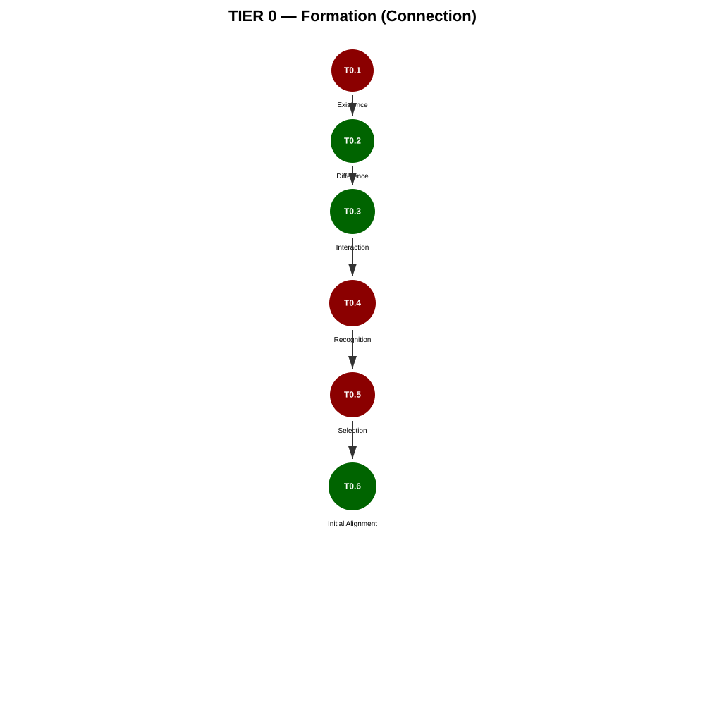
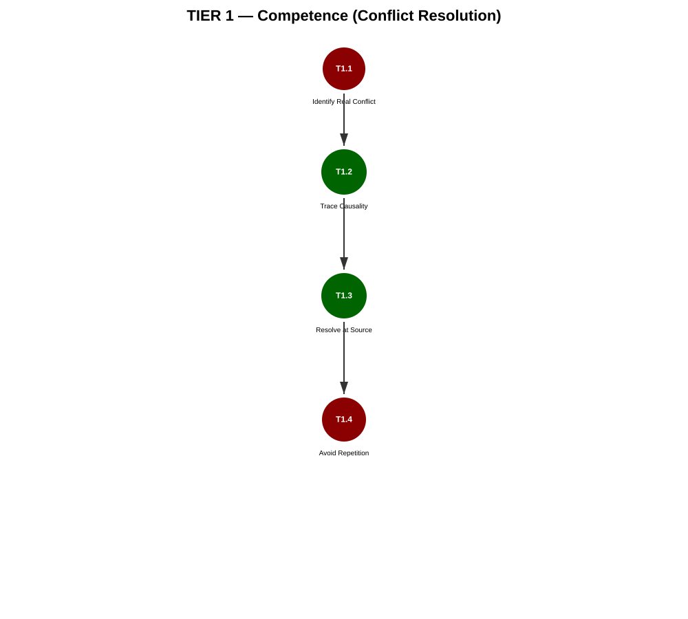
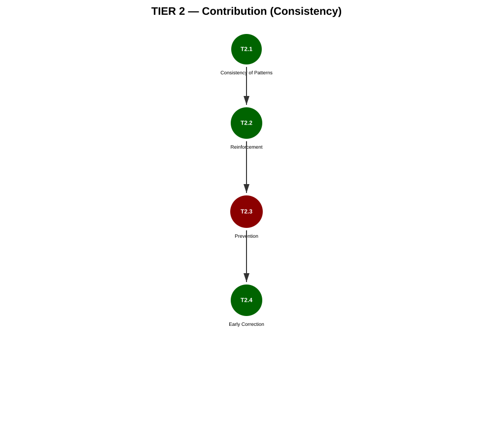
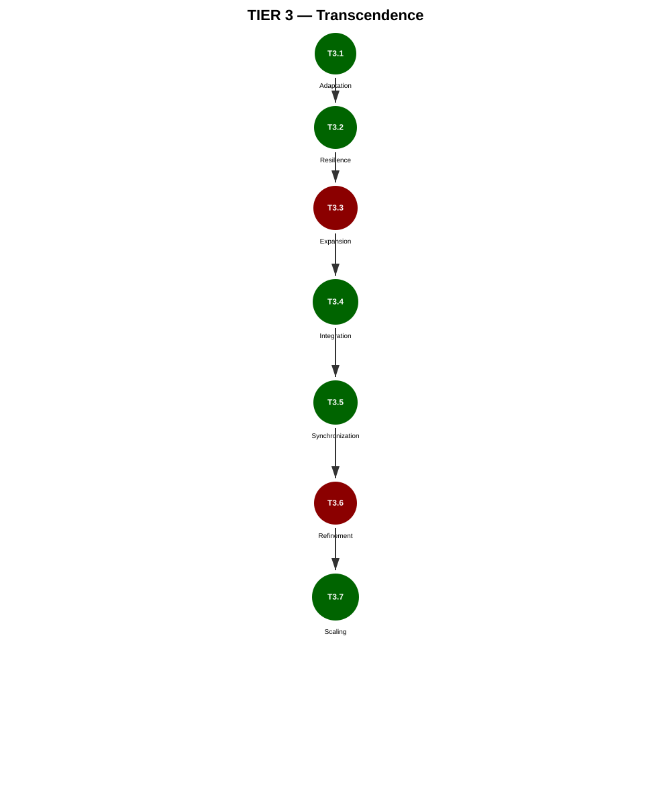
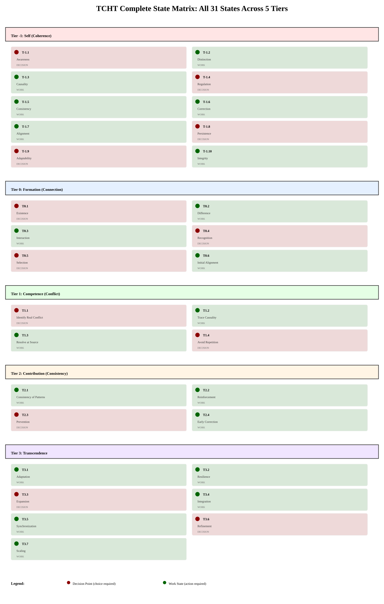
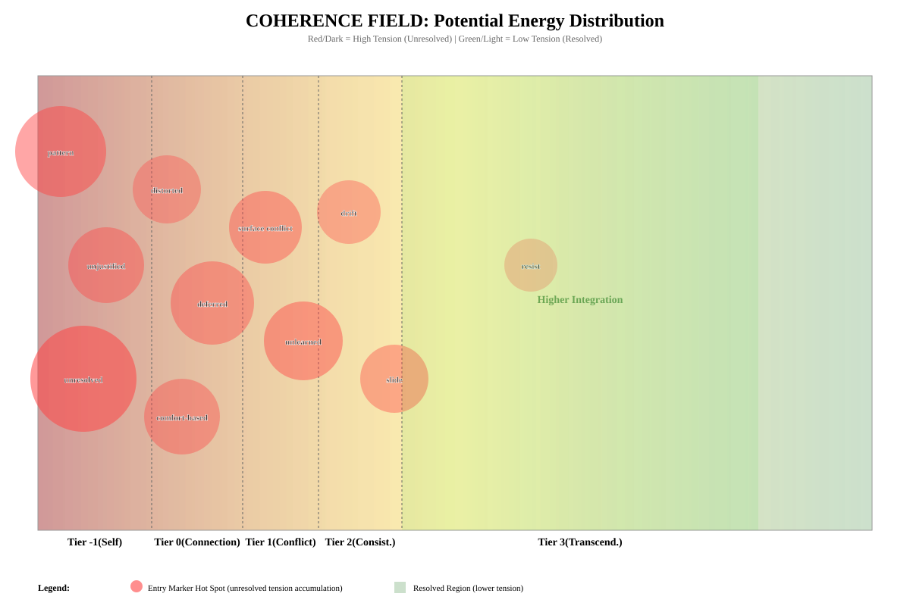

# THE COLD HARD TRUTH
## A Complete System for Understanding Coherence, Connection, and Transcendence

**April 15, 2026**

---

## Introduction

This book contains the complete TCHT system: 5 tiers, 31 decision states, and the visual framework for understanding how they interconnect.

Each tier is accompanied by illustrations showing the state progression, decision points, entry markers, and feedback loops.

### How to Use This Book

1. **Read sequentially** to understand the full system
2. **Refer to the tier illustrations** to see state relationships
3. **Check the reference section** for complete state matrix and coherence field
4. **Use the decision matrix** to understand how choices create consequences

---

## The Five Tiers

| Tier | Theme | Function | States |
|------|-------|----------|--------|
| **Tier -1** | Self (Coherence) | Understanding yourself with honesty | 10 |
| **Tier 0** | Formation (Connection) | Real vs. performed connection | 6 |
| **Tier 1** | Competence (Conflict) | Resolving conflict at source | 4 |
| **Tier 2** | Contribution (Consistency) | Maintaining correct patterns | 4 |
| **Tier 3** | Transcendence | Integration of all prior work | 7 |

**Total States**: 31  
**Total Decision Points**: 12 (where choices matter)  
**Total Work States**: 19 (where action happens)

---

## Using the Illustrations

### Visual Language

All illustrations use consistent encoding:

- 🔴 **Red circle** = Decision point (a choice is required)
- 🟢 **Green circle** = Work state (action/processing required)
- ↓ **Solid line** = Primary progression path
- ⟿ **Dashed curved line** = Loop back (unresolved entry marker)
- ⟱ **Long dashed line** = Full reset (escalation)

### Reading Strategy

**Quick (30 seconds)**: Scan the title, follow the vertical flow, notice colors

**Engaged (5 minutes)**: Read each state name, trace loops, understand consequences

**Deep (15+ minutes)**: Study the state definitions, map entry markers, understand the system

---

## Reference Guide

For quick navigation:
- See "Complete State Matrix" in the Reference section for all 31 states
- See "Coherence Field Distribution" to understand where tension accumulates
- Check individual tier illustrations for specific state progressions

---

---

# Tier -1: Self (Coherence)

## Visual Reference

The complete state progression for Tier -1 is shown below:

---

# THE COLD HARD TRUTH ON THE PATH TO STABILITY IN CHOSEN FUTURES
## Your Decisions. Your Outcomes. No Shortcuts.

---

# FRONT MATTER

---

## How to Use This Book

This is not a self-help book.

It does not tell you what to do.

It shows you what happens based on what you choose.

Every section presents a real situation. You identify where you are in it. You choose a path. You follow the page reference. You deal with what comes next.

There are no good choices and bad choices.

There are only choices with consequences you can trace.

---

## What a Tier Is and Why Order Matters

This book is structured in tiers.

Each tier represents a layer of stability that must be built before the next one can hold.

Tier -1: Self
Tier 0: Connection
Tier 1: Conflict
Tier 2: Maintenance
Tier 3: Growth

You cannot build a stable connection on an unstable self.
You cannot resolve conflict in a relationship that was never properly formed.
You cannot maintain what was never resolved.
You cannot grow what is not stable.

This is not a moral position. It is a structural one.

Skipping a tier does not remove the problem. It hides it. It will surface later, at a higher cost.

The book will not stop you from skipping. But it will show you exactly what happens when you do.

---

## What UNRESOLVED Means

Throughout this book you will encounter the word UNRESOLVED.

This means: there is not enough information to determine what happens next.

When something in your situation is UNRESOLVED, it cannot be used to build the next step. It must be addressed before the path can continue.

UNRESOLVED is not failure. It is an accurate reading of an incomplete state.

The correct response to UNRESOLVED is not to guess. It is to go back and find what is missing.

---

## System Rules (Apply Across All Tiers)

These rules govern the entire book. They apply in every tier, every state, every choice.

**Rule 1 -- Entry Resolution**

An entry marker is resolved only when the state that produced it is revisited and the B path is completed without contradiction. Moving to a new state does not clear an entry marker. Only explicit resolution clears it.

**Rule 2 -- Multi-Entry Priority**

When multiple entry markers are active, resolve the earliest-origin marker first. This prevents surface fixes that leave deeper sources running. A newer problem that blocks resolution of an older one must be named before the older one can be addressed.

**Rule 3 -- Loop Escape**

If a state is revisited more than once with the same entry marker still unresolved, the system is in a locked loop. Stop. Escalate to the originating state of that marker. The loop will not break from within -- it must be addressed at the source.

**Rule 4 -- Hard Gate**

No unresolved entry markers are permitted at prerequisite completion. The prerequisite sheet does not accept "noted but unresolved." Every active entry marker must be resolved before the next tier opens. There are no exceptions.

**Rule 5 -- Full Reset**

When a full reset is triggered (T-1.9.A), all active entry markers persist and no prior resolution is counted as valid. The reader returns to the starting state of the tier carrying everything. Nothing is cleared by a full reset -- it is a return to the beginning with full accumulated history.

**Rule 6 -- Path Validation**

The path written on any prerequisite sheet must be traceable through the valid transitions in this book. If the path written does not match the available routing options, the sheet is not complete. The actual path must be found and written before continuing.

---

## How Your History Travels With You

Every choice you make in this book carries forward.

If something was not resolved at an earlier state, it arrives at the next state as additional weight in the tension block. You will see it named there.

Entry markers are labels that show how you arrived at a state and what you are carrying. They do not clear when you move to a new state. They clear only when the tension that produced them is explicitly resolved through the B path.

The only way to clear carried history is to go back and resolve what was left unresolved.

---

## The Note System

Each decision state contains a note area.

Write what you actually observe. Not what you hope. Not what you fear. What is actually true right now.

If you cannot write something observable, it goes in UNRESOLVED.

---

## The Prerequisite Sheets

At the end of each tier you will find a prerequisite sheet.

This sheet must be completed before entering the next tier.

It asks for observable evidence that each condition is met, a complete trace of the path you actually took, and confirmation that all entry markers have been resolved.

No unresolved entry markers are permitted at completion. No exceptions.

These sheets are printable. Keep them.

---
---

# TIER -1 — SELF (COHERENCE)

---

## Opening: Why This Tier Exists

Before anything else, there is you.

Not the version of you that other people see. Not the version you present when things are going well. The version that exists when no one is watching and nothing is working.

That is the version this tier is about.

Most people skip this.

They move straight to relationships, goals, plans. They build on a foundation they have never actually checked. And then they wonder why things keep collapsing.

This tier does not ask you to be fixed.

It asks you to be honest about what is actually there.

That is harder than it sounds. But it is the only starting point that works.

---

## A Note on How This Tier Works

Each state has three choices.

A -- continue as you are. The tension increases.
B -- engage with what is actually happening. The path moves toward resolution.
C -- avoid. The tension does not go away. It reappears elsewhere, larger.

The system rules from the front matter apply here. Entry markers persist until resolved. Multiple active markers are resolved in order of origin. If a state is revisited more than once with the same marker unresolved, apply the loop escape rule.

The only way out is through.

---

### STATE T-1.1 — AWARENESS
*Starting state. All readers begin here.*

**Situation**

You are in a situation that is not going the way you expected. You are not sure why. Something is off but you cannot name it.

**OBSERVED:**
- The situation is not resolving as expected
- The source of the problem has not been identified

**UNRESOLVED:**
- Whether the source is internal or external
- Whether you have accurate information about the situation

**TENSION:**
- You cannot correct what you cannot see
- Action without awareness produces random outcomes

*If you arrived here [entry: repeated avoidance]: avoidance has occurred more than once before reaching this state. The pattern of not examining what is happening is now itself something that needs to be named. Tension is heavier than on a first pass.*

*If you arrived here [entry: full history unresolved]: all prior entry markers are still active. No previous resolution counts. Begin from this state carrying everything.*

*If you arrived here carrying any other entry marker: that marker is still active. Check what you are carrying before choosing. Apply Rule 2 if multiple markers are present.*

**Your choices:**

A) Keep responding the same way and wait for the situation to change
-- The pattern continues unexamined. You arrive at T-1.3 [entry: pattern already running].

B) Stop. Observe before acting. Name what is actually happening before doing anything else
-- Awareness begins. You move to T-1.2.

C) Distract from the discomfort. Deal with it later
-- Avoidance becomes its own pattern. You arrive at T-1.8 [entry: avoidance from the start].

**Notes:**
*What do I actually observe about this situation right now? What entry markers am I carrying?*

_______________________________________________
_______________________________________________
_______________________________________________
_______________________________________________

---

### STATE T-1.2 — DISTINCTION

**Situation**

Something happened. You have a strong reaction to it. You are not sure if your reaction matches what actually occurred or if something from the past is shaping how you see it.

**OBSERVED:**
- An event occurred
- A reaction followed
- Whether the reaction fits this specific event is not yet confirmed

**UNRESOLVED:**
- Whether the reaction is responding to this event or a prior one
- Whether the interpretation of the event is accurate

**TENSION:**
- If reaction and event are not matched, your response will be misaligned
- Misaligned response cannot resolve the actual situation

**Your choices:**

A) Trust the reaction. Respond based on how it feels
-- Misalignment compounds. You arrive at T-1.7 [entry: reaction-driven, distinction not made].

B) Separate what happened from how it felt. Check if the reaction fits this situation specifically
-- Distinction begins. You move to T-1.3.

C) Suppress the reaction. Do not examine it
-- Suppression degrades regulation capacity. You arrive at T-1.4 [entry: suppressed before regulation was built].

**Notes:**
*What actually happened? What was my reaction? Are they proportionate?*

_______________________________________________
_______________________________________________
_______________________________________________
_______________________________________________

---

### STATE T-1.3 — CAUSALITY

**Situation**

A pattern keeps repeating in your life. Different circumstances, different people, same result. You are starting to notice it but you are not sure what is causing it.

**OBSERVED:**
- A pattern has repeated across multiple situations
- The pattern produces the same outcome regardless of external variables

**UNRESOLVED:**
- The specific internal behavior driving the pattern
- Whether the pattern is fully visible yet

**TENSION:**
- A pattern that cannot be traced cannot be changed
- External changes will not resolve an internal cause

*If you arrived here [entry: pattern already running] from T-1.1.A: the pattern has been running unexamined. Tension is heavier because time has passed without examination.*

*Loop check: if you have arrived here more than once with [entry: pattern already running] unresolved, apply Rule 3. Escalate to T-1.1 and name the awareness failure directly before continuing.*

**Your choices:**

A) Assume the pattern is caused by external factors. Wait for circumstances to change
-- Pattern deepens. You arrive at T-1.6 [entry: pattern uncorrected, source not traced].

B) Trace the pattern backward. Find the consistent internal variable across all instances
-- Causality identified. You move to T-1.4.

C) Acknowledge the pattern exists but do not examine it
-- Repeated avoidance. You return to T-1.1 [entry: repeated avoidance].

**Notes:**
*What is the pattern? What is consistent across every instance of it?*

_______________________________________________
_______________________________________________
_______________________________________________
_______________________________________________

---

### STATE T-1.4 — REGULATION

**Situation**

You are under pressure. Your responses are becoming less consistent. You are saying or doing things that create more problems than they solve.

**OBSERVED:**
- Pressure is present
- Response consistency has decreased
- Secondary problems are emerging from your responses

**UNRESOLVED:**
- The specific threshold at which regulation breaks down
- What triggers the breakdown

**TENSION:**
- Unregulated responses create new tensions that must also be resolved
- Each unregulated response adds to the total load

*If you arrived here [entry: suppressed before regulation was built] from T-1.2.C: suppression has been weakening regulation capacity before the pressure arrived. The threshold is lower than it would otherwise be. The suppressed reaction is still present as unresolved weight and must be resolved before regulation can fully hold.*

*Rule 2 applies: if carrying multiple markers, resolve the earliest-origin one first.*

**Your choices:**

A) Continue. Push through. The pressure will pass
-- Unregulated responses compound. You arrive at T-1.8 [entry: regulation not built, persistence compromised].

B) Identify the specific point where regulation breaks. Build a response for that point before it is reached again
-- Regulation begins to hold. You move to T-1.5. Active entry markers continue forward.

C) Remove yourself from situations that cause pressure
-- Withdrawal blocks adaptability before it is built. You arrive at T-1.9 [entry: avoidance under pressure].

**Notes:**
*What is my regulation threshold? What are the specific triggers? What entry markers am I carrying?*

_______________________________________________
_______________________________________________
_______________________________________________
_______________________________________________

---

### STATE T-1.5 — CONSISTENCY

**Situation**

You behave differently depending on who is present. With some people you are one version of yourself. With others, a different version. You are not sure which one is real.

**OBSERVED:**
- Behavior varies significantly across contexts
- The variation is reactive, not deliberate

**UNRESOLVED:**
- Which behaviors are chosen and which are performed
- Whether a stable core exists beneath the variation

**TENSION:**
- A self that changes shape for every context cannot be known -- by others or by itself
- Decisions made from an inconsistent state produce inconsistent outcomes

**Your choices:**

A) Continue adapting to each context. It works well enough
-- Inconsistency feeds into values check without a stable base. You arrive at T-1.7 [entry: inconsistent base, alignment check unreliable].

B) Identify which behaviors are consistent regardless of context. Build from those
-- Consistency found. You move to T-1.6. Active entry markers continue forward.

C) Do not examine the variation
-- Unexamined inconsistency enters integrity check. You arrive at T-1.10 [entry: consistency not examined].

**Notes:**
*What is consistent about me regardless of who is present?*

_______________________________________________
_______________________________________________
_______________________________________________
_______________________________________________

---

### STATE T-1.6 — CORRECTION

**Situation**

You made a decision that produced a bad outcome. You know it. The question is what you do with that knowledge.

**OBSERVED:**
- A decision was made
- The outcome was negative
- The connection between the decision and the outcome is visible

**UNRESOLVED:**
- Whether the correction will be applied or resisted
- Whether the same decision will be made again

**TENSION:**
- Knowing and not correcting produces the same outcome as not knowing
- The cost of the pattern increases with each repetition

*If you arrived here [entry: pattern uncorrected, source not traced] from T-1.3.A: the pattern has already repeated without examination. The correction needed here is larger. The untraced source is still active and must be addressed as part of the correction, not separately.*

*Loop check: if you have arrived here more than once with [entry: pattern uncorrected] unresolved, apply Rule 3. The loop is locked. Escalate to T-1.3 and complete the trace before returning.*

**Your choices:**

A) Justify the original decision. The outcome was bad luck or someone else's fault
-- Unjustified explanation constructed. You arrive at T-1.7 [entry: unjustified].
This entry persists through T-1.8, T-1.9, and T-1.10 until T-1.6 is revisited and the B path is completed without contradiction. It cannot be cleared by any other means.

B) Accept the connection between the decision and the outcome. Identify what the correct decision would have been. Apply it next time
-- Correction made honestly. You arrive at T-1.7 [entry: corrected].
This entry persists as a lighter trace through subsequent states, confirming the correction was made at source.

C) Acknowledge it was bad but do not examine why
-- Unexamined error will repeat. You return to T-1.3 [entry: pattern uncorrected, source not traced].

**Notes:**
*What was the decision? What was the outcome? What is the connection? Am I constructing an explanation or accepting the connection?*

_______________________________________________
_______________________________________________
_______________________________________________
_______________________________________________

---

### STATE T-1.7 — ALIGNMENT

**How you arrived here matters. Read the section that applies.**

---

**If you arrived here [entry: unjustified] from T-1.6.A:**

You are carrying an explanation that did not hold. That explanation is sitting between you and an honest look at your values. The tension here is not just about alignment -- it is about whether you are willing to put down a justification that felt necessary at the time.

This entry marker cannot be cleared here. It clears only when you return to T-1.6 and complete the B path without contradiction. Until then it is present in every subsequent state.

**If you arrived here [entry: corrected] from T-1.6.B:**

The correction was made honestly. The tension here is real but it is on honest ground. The gap between what you say you value and what you do is visible without a false layer on top of it.

**If you arrived here [entry: reaction-driven, distinction not made] from T-1.2.A:**

The unexamined reaction is influencing how you read your own values. The picture of alignment you form here may be shaped by an emotional state rather than what is actually true. This entry marker persists until T-1.2 is revisited and the B path completed.

**If you arrived here [entry: inconsistent base, alignment check unreliable] from T-1.5.A:**

Consistency has not been established. The alignment assessed here may reflect whichever version of yourself is currently active, not a stable self. This entry marker persists until T-1.5 is revisited and the B path completed.

**If you arrived here [entry: integrity failure] from T-1.10.A:**

Integrity failed at T-1.10 and returned here. The alignment check is now being conducted with the knowledge that integrity was not maintained. This entry persists until integrity is genuinely established at T-1.10.B.

*Rule 2 applies: if carrying multiple markers, resolve the earliest-origin one first.*

---

**Situation**

What you say you value and what you actually do are not matching. You can see the gap but you keep choosing the same way.

**OBSERVED:**
- Stated values exist
- Actions consistently contradict those values
- The gap is visible and recurring

**UNRESOLVED:**
- Whether stated values are actual values or desired identity
- What is actually being selected when the gap appears

**TENSION:**
- A system that selects against its own stated values is internally contradictory
- Internal contradiction cannot produce stable external outcomes

**Your choices:**

A) Keep the stated values. Keep the contradicting behavior. Manage the discomfort
-- Alignment gap enters integrity check unresolved. You arrive at T-1.10 [entry: alignment gap unresolved].

B) Either update the stated values to match actual behavior, or change the behavior to match stated values. Pick one. Be honest about which. Address any active entry markers that are influencing this check before confirming
-- Alignment addressed. You move to T-1.8. Entry markers from T-1.6 persist until their source state is revisited and B completed.

C) Do not look at the gap directly
-- Avoidance returns to consistency check. You return to T-1.5 [entry: alignment avoided, consistency recheck needed].

**Notes:**
*What do I say I value? What do my actions show I value? What active entries am I carrying that may be distorting this check?*

_______________________________________________
_______________________________________________
_______________________________________________
_______________________________________________

---

### STATE T-1.8 — PERSISTENCE

**Situation**

You started something that matters to you. It got difficult. You stopped. This has happened before with things that mattered.

**OBSERVED:**
- A pattern of stopping when difficulty increases
- The stopping point is consistent across different efforts
- The things stopped were genuinely valued

**UNRESOLVED:**
- Whether the stopping is a decision or a default
- What specifically triggers the stop

**TENSION:**
- Persistence that only holds under easy conditions is not persistence
- A self that stops at the same point repeatedly cannot build anything beyond that point

*If you arrived here [entry: avoidance from the start] from T-1.1.C: avoidance has been the default since the beginning. The pattern here is not new -- it has been running. The [avoidance from the start] marker is still active and must be resolved by returning to T-1.1 and completing the B path.*

*If you arrived here [entry: regulation not built, persistence compromised] from T-1.4.A: unregulated responses under pressure have compromised the capacity to persist. Regulation gap is still present as an active source.*

*If you are carrying [entry: unjustified] from T-1.6.A: this marker is still active. It may be generating a false justification for stopping. It cannot be cleared here -- only at T-1.6.B.*

*Rule 2 applies: resolve earliest-origin marker first.*

**Your choices:**

A) Accept that this is how you work. Start things knowing you will likely stop
-- Accepted limit forecloses adaptability before examination. You arrive at T-1.9 [entry: stopping accepted as permanent].

B) Identify the exact point where stopping becomes likely. Build a specific response for that point before it arrives
-- Persistence begins to hold. You move to T-1.9. Active entry markers continue forward.

C) Do not start things that require persistence
-- Avoidance enters integrity check before persistence is established. You arrive at T-1.10 [entry: persistence avoided].

**Notes:**
*Where is my stopping point? What does it feel like just before I stop? What active entries am I carrying?*

_______________________________________________
_______________________________________________
_______________________________________________
_______________________________________________

---

### STATE T-1.9 — ADAPTABILITY

**Situation**

Something changed that you did not choose and cannot reverse. Your previous approach no longer works. You are holding onto it anyway.

**OBSERVED:**
- A change occurred outside your control
- The previous approach is no longer effective
- The previous approach is still being applied

**UNRESOLVED:**
- Whether a new approach has been identified
- Whether resistance to change is preventing observation of what is actually needed

**TENSION:**
- Applying a failed approach repeatedly increases the cost of the eventual change
- What worked before is not evidence it will work now

*If you arrived here [entry: avoidance under pressure] from T-1.4.C: withdrawal has been the response to pressure. Adaptation requires sustained engagement. The avoidance pattern is still active and will resist the change required here. Must be resolved by returning to T-1.4 and completing B.*

*If you arrived here [entry: stopping accepted as permanent] from T-1.8.A: a limit was accepted as fixed before it was examined. That acceptance is making the required change feel more permanent than it is.*

*If you are carrying [entry: unjustified] from T-1.6.A: still active here. May be generating a false reason for why the old approach must be kept. Cannot be cleared here.*

*Rule 2: resolve earliest-origin marker first.*

*Loop check: if you have arrived here more than once with the same unresolved marker, apply Rule 3. Escalate to the originating state of that marker.*

**Your choices:**

A) Continue the previous approach. The situation will revert
-- Full reset triggered. You return to T-1.1 [entry: full history unresolved]. All active entry markers persist. No prior resolution counts as valid.

B) Accept the change as fixed. Identify what the situation actually requires now. Build from that
-- Adaptability holds. You move to T-1.10. Active entry markers continue forward.

C) Withdraw from the changed situation entirely
-- Withdrawal returns to correction as an uncorrected pattern. You return to T-1.6 [entry: pattern uncorrected, source not traced].

**Notes:**
*What changed? What am I still applying that no longer fits? What active entries am I carrying?*

_______________________________________________
_______________________________________________
_______________________________________________
_______________________________________________

---

### STATE T-1.10 — INTEGRITY

**Situation**

You made a commitment to yourself. You broke it. You made an explanation for why it was acceptable. You are not sure if the explanation is honest.

**OBSERVED:**
- A commitment was made
- The commitment was broken
- An explanation was constructed
- Whether the explanation holds is uncertain

**UNRESOLVED:**
- Whether the explanation is accurate or self-protective
- Whether the commitment will be made and broken again

**TENSION:**
- A self that cannot keep commitments to itself cannot be trusted by itself
- Decisions built on untrustworthy foundations produce unstable outcomes

*If you arrived here [entry: alignment gap unresolved] from T-1.7.A: an unresolved alignment gap is present. The integrity check is being conducted on a self that is already internally contradictory. This check cannot fully hold until the alignment gap at T-1.7 is addressed. If attempting B here, the result is conditional until T-1.7.B is completed.*

*If you arrived here [entry: consistency not examined] from T-1.5.C: consistency was not established. The commitment being examined may belong to a version of yourself that is not consistently present. Must return to T-1.5.B before integrity can be confirmed.*

*If you arrived here [entry: persistence avoided] from T-1.8.C: persistence was avoided before it was built. The commitment may have failed in part because the capacity to keep it was never established.*

*If you are carrying [entry: unjustified] from T-1.6.A: this marker is still active and must be addressed here. If the unjustified explanation is still present when B is chosen, the integrity result is not clean. Address T-1.6 before confirming integrity.*

*Rule 4 applies: no unresolved entry markers permitted at completion. All active markers must be resolved before moving to the prerequisite sheet.*

**Your choices:**

A) Accept the explanation. Move on. The commitment was unrealistic
-- Integrity failure confirmed. You return to T-1.7 [entry: integrity failure]. The alignment check must be conducted with this knowledge.

B) Examine the explanation honestly. If it does not hold, admit the break was a choice. Reset the commitment with that knowledge. Resolve any active entry markers that are influencing this check before confirming. If [entry: unjustified] is still active, return to T-1.6 first
-- Integrity confirmed when all conditions are met. You move to the Prerequisite Sheet. Entry markers that have been resolved through their originating B path are cleared. Any unresolved markers require return before the gate opens.

C) Do not make commitments that can be broken
-- Avoidance of commitment returns to persistence. You return to T-1.8 [entry: integrity avoided, persistence recheck needed].

**Notes:**
*What was the commitment? What was the explanation? Does it hold? What active entries am I carrying? Have I resolved all of them through their originating B paths?*

_______________________________________________
_______________________________________________
_______________________________________________
_______________________________________________

---
---

# TIER -1 PREREQUISITE SHEET
## Complete this before continuing to Tier 0
## This page is printable. Keep it.

---

**Instructions**

Write observable evidence for each statement below. Not intention. Not effort. Not feeling. What is actually, observably true right now.

**Rule 4 -- Hard Gate:**
No unresolved entry markers are permitted at completion. Every active entry marker must be resolved through its originating B path before this sheet is complete. There are no exceptions.

**Rule 6 -- Path Validation:**
The path you write must be traceable through the valid transitions in this book. If the path you write does not match the available routing options, the sheet is not complete.

---

**1. I can identify my internal state without external input.**

Evidence:
_______________________________________________
_______________________________________________

If UNRESOLVED -- return to T-1.1

---

**2. My responses are consistent regardless of who is present.**

Evidence:
_______________________________________________
_______________________________________________

If UNRESOLVED -- return to T-1.5

---

**3. I have traced a recurring pattern to its internal cause.**

Evidence:
_______________________________________________
_______________________________________________

If UNRESOLVED -- return to T-1.3

---

**4. I have corrected a behavior after identifying it as a problem and the correction held.**

Evidence:
_______________________________________________
_______________________________________________

If UNRESOLVED -- return to T-1.6

---

**5. What I say I value and what I actually do are aligned.**

Evidence:
_______________________________________________
_______________________________________________

If UNRESOLVED -- return to T-1.7

---

**6. I have kept a commitment to myself under difficult conditions.**

Evidence:
_______________________________________________
_______________________________________________

If UNRESOLVED -- return to T-1.8

---

**7. I do not require external stability to maintain my own.**

Evidence:
_______________________________________________
_______________________________________________

If UNRESOLVED -- return to T-1.4

---

**Entry marker check:**

List every entry marker you were carrying at any point in Tier -1.

For each one: name it, name the state that produced it, and state whether it was resolved through its originating B path.

If any entry marker is not resolved through its originating B path, return to that state before continuing.

Entry marker / originating state / resolved (yes/no):

_______________________________________________
_______________________________________________
_______________________________________________
_______________________________________________

---

**Path trace:**

Write the actual path you took through Tier -1. Include state labels and choices made at each state. Include every return and why.

This path must be traceable through the valid transitions in this book.

_______________________________________________
_______________________________________________
_______________________________________________
_______________________________________________
_______________________________________________
_______________________________________________

---

**Tier Gate**

Before you enter Tier 0, read this once.

Tier 0 is about forming a connection with another person.

That person will interact with your actual state -- not the state you intend to be in, not the state you are working toward.

If your internal state is unstable, that instability will enter the connection. It will not stay hidden. It will surface as conflict, as confusion, or as slow drift.

You do not have to be perfect to continue.

But you must be honest about what you are bringing.

---

**Sign and date this sheet when complete.**

Name: _______________________________________________

Date: _______________________________________________

What I know to be true about my current state:

_______________________________________________
_______________________________________________
_______________________________________________
_______________________________________________

---

*Continue to Tier 0 when this sheet is complete, all entry markers resolved, and path traceable.*

---

# Tier 0: Formation (Connection)

## Visual Reference

The complete state progression for Tier 0 is shown below:

---

# TIER 0 — FORMATION (COMPATIBILITY)

---

## Opening: Why Self Must Come Before Connection

You made it through Tier -1.

That means you have done something most people never do: you looked at yourself honestly enough to name what is actually there.

That is not small.

But here is the thing about connection.

You are not connecting with someone who knows your internal work. You are connecting with someone who experiences your output. What you do. How you respond. What you bring into the space between you.

If Tier -1 is still unresolved underneath, it will show up here. Not immediately, maybe. But it will show up.

Tier 0 is not about finding the right person.

It is about establishing whether a real connection is forming -- or whether what feels like connection is something else.

Surface signals feel like connection. Shared interests. Easy conversation. Physical attraction. Familiarity.

None of those are connection.

Connection is when two people are actually present to each other's real state. When what each person brings is seen accurately, not just accepted because it feels comfortable.

That is rarer than most people think.

This tier helps you find out which one you are in.

---

## A Note on How This Tier Works

The six states in this tier follow the conditions required for a real connection to form. They must be met in sequence. You cannot have recognition without real exchange. You cannot have genuine selection without accurate recognition.

All six system rules from the front matter apply here.

Entry markers persist until resolved through their originating B path. Multiple active markers are resolved in order of origin. If a state is revisited more than once with the same marker unresolved, apply Rule 3 -- escalate to the originating state of that marker.

The cross-tier entry points from Tier -1 persist here. If you arrived at Tier 0 carrying any unresolved markers from Tier -1, they remain active and must be resolved before this tier's prerequisite sheet can be completed.

A, B, and C work the same way throughout:

A -- continue as you are. Tension increases.
B -- engage honestly. The path moves toward resolution.
C -- avoid. Tension defers and reappears larger.

---

### STATE T0.1 — EXISTENCE (PRESENCE)

**Situation**

You are in early contact with someone. There is interest. But you are not sure if you are actually present in this interaction or presenting a version of yourself designed to be received well.

**OBSERVED:**
- Contact is occurring
- Interest is present on at least one side
- Whether the version of yourself being presented is accurate is not confirmed

**UNRESOLVED:**
- Whether you are responding to this person as they actually are
- Whether you are showing up as you actually are

**TENSION:**
- A connection built on performed versions is not a connection between those people
- It is a connection between performances
- Performances collapse under pressure

*If you arrived here carrying unresolved consistency markers from T-1.5: the version you are presenting may already be shaped by who you think this person wants you to be. That pattern was running before this interaction started. It must be resolved at its originating state before presence here can be confirmed.*

*Rule 2 applies: if carrying multiple markers from Tier -1, resolve the earliest-origin one first.*

**Your choices:**

A) Continue presenting the version most likely to be received well
-- Performance becomes the foundation. You arrive at T0.3 [entry: distorted exchange].

B) Check whether what you are presenting matches what is actually true about you right now. Adjust if it does not
-- Presence begins. You move to T0.2.

C) Avoid examining this. The interaction is going well enough
-- Deferred presence creates a gap that will affect recognition. You arrive at T0.4 [entry: deferred presence].

**Notes:**
*Am I actually present in this interaction or performing? What is the difference right now? What markers am I carrying from Tier -1?*

_______________________________________________
_______________________________________________
_______________________________________________
_______________________________________________

---

### STATE T0.2 — DIFFERENCE (USABLE GRADIENT)

**Situation**

You are noticing differences between yourself and this person. Some feel interesting. Some feel uncomfortable. You are not sure whether the differences are workable or whether they signal a genuine mismatch.

**OBSERVED:**
- Differences exist between you and this person
- Some differences produce interest
- Some differences produce discomfort

**UNRESOLVED:**
- Whether the differences are resolvable through interaction
- Whether the discomfort is a signal or a reaction to unfamiliarity

**TENSION:**
- Sameness does not create connection -- it creates comfort
- Difference is what makes interaction necessary
- Not all differences are workable
- Avoiding real differences now means carrying them into conflict later

**Your choices:**

A) Focus on the similarities. Manage the differences by minimising them
-- Unexamined differences remain active. You arrive at T0.5 [entry: comfort-based selection].

B) Examine the differences directly. Identify which ones produce useful interaction and which signal genuine mismatch
-- Real gradient identified. You move to T0.3.

C) Avoid the uncomfortable differences entirely
-- Avoided differences become conflict. You move directly to T1.1 [entry: avoided difference, Tier 0 formation incomplete].

**Notes:**
*What are the real differences between us? Which feel workable? Which feel like genuine mismatches?*

_______________________________________________
_______________________________________________
_______________________________________________
_______________________________________________

---

### STATE T0.3 — INTERACTION (EXCHANGE)

**Situation**

You are in active exchange with this person. Things are being said, shared, revealed. But you are not sure if what is being exchanged is real information about each other or curated versions designed to maintain the interaction.

**OBSERVED:**
- Exchange is occurring
- Information about each other is being shared
- Whether that information accurately represents how each person operates is unclear

**UNRESOLVED:**
- Whether what is being shared reflects how each person actually operates
- Whether the exchange changes anything or just maintains proximity

**TENSION:**
- Exchange that does not reveal real information produces false understanding
- False understanding is the foundation of most failed connections

*If you arrived here [entry: distorted exchange] from T0.1.A: the exchange occurring now is between performances. What is being learned about each other is not accurate. The distortion started before this exchange did and is still present as an active source.*

*Loop check: if you have arrived here more than once with [entry: distorted exchange] unresolved, apply Rule 3. Escalate to T0.1 and establish genuine presence before returning.*

**Your choices:**

A) Continue the exchange as it is. It feels good and that is enough for now
-- Distortion deepens. You arrive at T0.4 [entry: distorted exchange].

B) Introduce something real into the exchange. Something that reveals how you actually operate, not how you want to be seen. Observe whether this person responds to the real version
-- Real exchange begins. You arrive at T0.4 [entry: real exchange].

C) Keep the exchange comfortable. Avoid anything that might change the tone
-- Information withheld. You arrive at T0.4 [entry: incomplete exchange].

**Notes:**
*What has been genuinely exchanged so far? What have I withheld? Why?*

_______________________________________________
_______________________________________________
_______________________________________________
_______________________________________________

---

### STATE T0.4 — RECOGNITION (ACCURATE UNDERSTANDING)

**Situation**

You have been in contact with this person for some time. You have a picture of who they are. But you are not sure if the picture is accurate or if it is what you constructed from what you wanted to see.

**OBSERVED:**
- A picture of this person has formed
- That picture is based on exchanges that have occurred
- Whether those exchanges accurately represent how each person operates is uncertain

**UNRESOLVED:**
- Whether your picture of this person matches how they actually operate
- Whether their picture of you matches how you actually operate

**TENSION:**
- A connection built on inaccurate understanding fails at the first point of real pressure
- The longer inaccurate understanding holds, the more disorienting the correction will be

*If you arrived here [entry: distorted exchange] from T0.3.A: the picture formed is based on performed versions. The recognition check here is not starting from neutral -- it requires correction before it can be built on. The distorted exchange entry is still active.*

*If you arrived here [entry: real exchange] from T0.3.B: the picture has a real foundation. The recognition check here is about confirming and testing what is already present.*

*If you arrived here [entry: incomplete exchange] from T0.3.C: the picture is partial. Gaps exist that have not been filled. The recognition check will surface them.*

*If you arrived here [entry: deferred presence] from T0.1.C: presence was never established. The picture this person has of you is incomplete at the source. This must be addressed before recognition can be confirmed.*

*Rule 2: if carrying multiple markers, resolve earliest-origin first.*

*Loop check: if revisiting this state more than once with the same marker unresolved, apply Rule 3.*

**Your choices:**

A) Trust the picture you have formed. It feels right
-- Untested understanding becomes the foundation. You arrive at T0.5 [entry: untested picture].

B) Test the picture. Introduce a situation that reveals how this person actually operates -- a mild pressure, a disagreement, an honest question -- and observe what actually happens
-- Recognition becomes accurate. You arrive at T0.5 [entry: tested picture].

C) Do not test the picture. It might change something that feels good
-- Deferred recognition will collapse at first real pressure. You move to T1.2 [entry: deferred recognition, Tier 0 formation incomplete].

**Notes:**
*What is my picture of this person? What has actually been tested? What has not? What active entries am I carrying?*

_______________________________________________
_______________________________________________
_______________________________________________
_______________________________________________

---

### STATE T0.5 — SELECTION (MUTUAL CONTINUATION)

**Situation**

A choice point has arrived. You could continue building this connection or you could step back. You are aware that both of you are making this choice, not just you.

**OBSERVED:**
- Both people are still present
- A choice about continuation is being made
- The basis on which that choice is being made may or may not be accurate

**UNRESOLVED:**
- Whether continuation is being chosen based on real understanding or comfort
- Whether the other person is choosing based on an accurate picture of you

**TENSION:**
- Selection based on inaccurate understanding produces a connection neither person actually consented to
- Both people agreed to something -- but they may not have agreed to the same thing
- Default continuation is not selection -- it is momentum

*If you arrived here [entry: comfort-based selection] from T0.2.A: you are selecting based on similarity and comfort. The real differences are still present and unexamined. They will surface later as conflict.*

*If you arrived here [entry: untested picture] from T0.4.A: you are selecting based on a picture that has not been verified. You do not yet know if what you are selecting is real.*

*If you arrived here [entry: tested picture] from T0.4.B: you have an accurate enough picture to make a real selection. The question now is whether the selection is mutual and explicit.*

*Rule 2: if carrying multiple markers, resolve earliest-origin first.*

**Your choices:**

A) Continue because it feels good and the momentum is there
-- Selection without real basis. You arrive at T0.6 [entry: comfort selection].

B) Make the selection explicitly. Name what you are choosing and why, based on what has actually been observed. Check whether this is mutual
-- Real selection occurs. You arrive at T0.6 [entry: real selection].

C) Avoid making the selection explicit. Let it continue by default
-- Default continuation without selection. Neither person has actually chosen this connection. You move to T1.3 [entry: default continuation, Tier 0 formation incomplete].

**Notes:**
*What am I actually choosing here? What is it based on? Is it mutual? Am I choosing or drifting?*

_______________________________________________
_______________________________________________
_______________________________________________
_______________________________________________

---

### STATE T0.6 — INITIAL ALIGNMENT (FIRST RESOLUTION)

**Situation**

You and this person have reached the first real point of difference that required resolution. Something came up that could not be ignored. You had to actually work it through.

**OBSERVED:**
- A real difference or tension arose between you
- Both people engaged with it
- Whether it was actually resolved or just managed is unclear

**UNRESOLVED:**
- Whether the tension is genuinely gone or just quieted
- Whether both people came out of it with the same understanding

**TENSION:**
- A managed tension is not a resolved one
- The pattern set at the first real difference becomes the pattern for how this connection handles all future conflict
- That pattern will repeat

*If you arrived here [entry: comfort selection] from T0.5.A: the resolution being attempted here is on a foundation that was not honestly chosen. Neither person is fully sure what they are resolving it for. The tension is harder because the commitment underneath it is unclear.*

*If you arrived here [entry: real selection] from T0.5.B: the foundation is honest. The resolution here is real work on ground that was actually chosen.*

*Any active entry markers from earlier in this tier are still present. Rule 4 applies at the prerequisite sheet -- all must be resolved before continuing.*

*Loop check: if revisiting this state more than once with the same marker unresolved, apply Rule 3.*

**Your choices:**

A) Accept that it resolved well enough. Move forward
-- Managed tension treated as resolved. You arrive at T1.1 [entry: managed tension, first resolution incomplete].

B) Check the resolution. Ask directly whether the other person feels it is actually resolved. Be honest about whether you do. If not, stay with it until it is
-- First real resolution achieved. You move to the Tier 0 Prerequisite Sheet.

C) Avoid revisiting it. It passed. Do not reopen it
-- Avoidance becomes the first established pattern. You arrive at T1.1 [entry: avoided resolution, first resolution incomplete].

**Notes:**
*Was this actually resolved or managed? How do I know? Did I check with the other person?*

_______________________________________________
_______________________________________________
_______________________________________________
_______________________________________________

---
---

# TIER 0 PREREQUISITE SHEET
## Complete this before continuing to Tier 1
## This page is printable. Keep it.

---

**Instructions**

Write observable evidence for each statement below. Not intention. Not effort. Not feeling. What is actually, observably true right now.

**Rule 4 -- Hard Gate:**
No unresolved entry markers are permitted at completion. Every active entry marker must be resolved through its originating B path before this sheet is complete. No exceptions.

**Rule 6 -- Path Validation:**
The path you write must be traceable through the valid transitions in this book.

---

**1. I was genuinely present in this connection -- not performing.**

Evidence:
_______________________________________________
_______________________________________________

If UNRESOLVED -- return to T0.1

---

**2. I examined the real differences between us, including the uncomfortable ones.**

Evidence:
_______________________________________________
_______________________________________________

If UNRESOLVED -- return to T0.2

---

**3. What was exchanged between us reflects how we actually operate, not curated versions.**

Evidence:
_______________________________________________
_______________________________________________

If UNRESOLVED -- return to T0.3

---

**4. My picture of this person has been tested, not just assumed.**

Evidence:
_______________________________________________
_______________________________________________

If UNRESOLVED -- return to T0.4

---

**5. The decision to continue was made explicitly, based on what was actually observed, and confirmed as mutual.**

Evidence:
_______________________________________________
_______________________________________________

If UNRESOLVED -- return to T0.5

---

**6. At least one real difference between us was resolved, not just managed. The resolution was confirmed by both people.**

Evidence:
_______________________________________________
_______________________________________________

If UNRESOLVED -- return to T0.6

---

**Entry marker check:**

List every entry marker carried at any point in Tier 0, including any carried in from Tier -1.

For each: name it, name the originating state, state whether it was resolved through its originating B path.

If any marker is unresolved, return to its originating state before continuing.

Entry marker / originating state / resolved (yes/no):

_______________________________________________
_______________________________________________
_______________________________________________
_______________________________________________

---

**Path trace:**

Write the actual path taken through Tier 0. Include state labels and choices made. Include every return and why.

This path must be traceable through the valid transitions in this book.

_______________________________________________
_______________________________________________
_______________________________________________
_______________________________________________
_______________________________________________

---

**Tier Gate**

Before you enter Tier 1, read this once.

Tier 1 is about conflict resolution.

Conflict will happen. The question is whether you have the tools to resolve it at the source.

If the connection was formed on accurate understanding and real selection, conflict in Tier 1 will be workable. Hard, but workable.

If the connection was formed on performance, comfort, or default continuation, the conflicts in Tier 1 will carry the weight of everything not resolved in Tier 0. They will feel disproportionate. They will repeat. They will not respond to effort alone.

You do not have to have done everything perfectly.

But you must know honestly what you are bringing.

---

**Sign and date this sheet when complete.**

Name: _______________________________________________

Date: _______________________________________________

What I know to be true about this connection right now:

_______________________________________________
_______________________________________________
_______________________________________________
_______________________________________________

---

*Continue to Tier 1 when this sheet is complete, all entry markers resolved, and path traceable.*

---

# Tier 1: Competence (Conflict)

## Visual Reference

The complete state progression for Tier 1 is shown below:

---

# TIER 1 — RESOLUTION (CONFLICT)

---

## Opening: Why Conflict Is Not the Problem

You are here because something between you and this person is not resolving cleanly.

That is not a sign the connection is failing.

It is a sign the connection is real enough to produce friction.

The question is not whether conflict exists. It will exist in any connection between two people who are actually present to each other. The question is whether you can resolve it at the source -- or whether you will manage it on the surface until the weight of what was not resolved becomes too heavy to carry.

Most people manage.

They find ways to reduce the immediate discomfort. They avoid the topics that reliably produce tension. They adjust their behavior in ways that keep the peace without addressing what is actually wrong. And for a while, it works.

Then it stops working.

Because managed tension does not disappear. It accumulates. It changes shape. It shows up as distance, as resentment, as a pattern of small withdrawals that neither person can quite name.

This tier asks you to do something harder than managing.

It asks you to identify what is actually wrong, trace it to where it starts, and resolve it there.

That requires honesty about what you observe, not what you feel. It requires the ability to stay with something uncomfortable long enough to understand it. And it requires accepting that resolution always changes something -- in you, in the other person, or in the connection itself.

---

## A Note on How This Tier Works

There are four states in this tier. Each one addresses a distinct failure point in how conflict gets handled.

All six system rules from the front matter apply here.

Entry markers from Tier 0 persist here and remain active until resolved through their originating B path. Cross-tier entries carry a "Tier 0 formation incomplete" label where they arrived without completing Tier 0. That label is active throughout this tier and must be resolved before the prerequisite sheet can be completed.

**Observable change requirement:**

Resolution is not confirmed until the change can be described in observable terms by both people -- something that can be seen or confirmed, not just stated or felt. If the change cannot be described in observable terms, return to T1.3 before treating resolution as complete.

The cross-tier entry points from Tier 0 are:

T1.1 [entry: managed tension, first resolution incomplete] -- from T0.6.A
T1.1 [entry: avoided resolution, first resolution incomplete] -- from T0.6.C
T1.1 [entry: avoided difference, Tier 0 formation incomplete] -- from T0.2.C
T1.2 [entry: deferred recognition, Tier 0 formation incomplete] -- from T0.4.C
T1.3 [entry: default continuation, Tier 0 formation incomplete] -- from T0.5.C

If you completed Tier 0 cleanly through T0.6.B, you enter Tier 1 at T1.1 without a carried cross-tier entry marker.

---

### STATE T1.1 — IDENTIFY REAL CONFLICT (NOT SURFACE)

**Situation**

There is tension between you and this person. You have identified what it seems to be about. But the argument or issue you can name does not quite account for the weight of what is actually happening. The surface issue feels too small for the reaction it produces.

**OBSERVED:**
- Tension is present
- A surface issue has been identified
- The surface issue does not fully account for the weight of the tension

**UNRESOLVED:**
- Whether the surface issue is the real conflict or a symptom of something deeper
- Whether prior unresolved differences are contributing weight to this conflict

**TENSION:**
- Resolving a surface issue does not resolve the underlying one
- The underlying conflict will reappear attached to a different surface issue next time

*If you arrived here [entry: managed tension, first resolution incomplete] from T0.6.A: the first real conflict in this connection was managed rather than resolved. What is present now includes that unresolved weight plus whatever triggered this new surface issue. Both are active sources.*

*If you arrived here [entry: avoided resolution, first resolution incomplete] from T0.6.C: avoidance was established as the pattern at the first real test. The avoidance pattern and the unresolved tension are both active.*

*If you arrived here [entry: avoided difference, Tier 0 formation incomplete] from T0.2.C: a real difference between you was identified and avoided before the connection formed. That difference is contributing weight to what is happening now. The Tier 0 formation incomplete label remains active.*

*If you arrived here [entry: accumulated weight]: this is not the first pass through this state. The underlying conflict has not been identified yet. The cost of not identifying it is increasing with each return.*

*Rule 2: if carrying multiple markers, resolve earliest-origin first.*
*Loop check: if revisiting with the same marker unresolved, apply Rule 3.*

**Your choices:**

A) Address the surface issue. It is manageable and that is enough for now
-- Surface resolution without source identification. You return to T1.1 [entry: accumulated weight].

B) Set the surface issue aside temporarily. Ask what the tension would be about if this specific trigger had not occurred. Look for what is consistent across multiple conflicts
-- Real conflict identified. You move to T1.2.

C) Withdraw from the conflict entirely. Give it time to settle
-- Withdrawal without examination. You arrive at T1.4 [entry: unexamined conflict].

**Notes:**
*What is the surface issue? What might be underneath it? What pattern keeps appearing across different arguments? What active entries am I carrying?*

_______________________________________________
_______________________________________________
_______________________________________________
_______________________________________________

---

### STATE T1.2 — TRACE CAUSALITY

**Situation**

You have identified that the real conflict is not what it appeared to be on the surface. Now you need to trace it back to where it actually starts.

**OBSERVED:**
- The surface issue has been set aside
- A pattern or deeper source of conflict has been partially identified
- The exact origin of the conflict has not yet been confirmed

**UNRESOLVED:**
- Whether the source is in this connection or carried in from outside it
- Whether one person is the primary origin or whether both are contributing
- Whether the source is visible to the other person

**TENSION:**
- A conflict traced to the wrong source will be resolved in the wrong place
- Resolution in the wrong place leaves the actual source intact and active
- An incomplete trace produces a partial resolution that leaves a remainder

*If you arrived here [entry: deferred recognition, Tier 0 formation incomplete] from T0.4.C: the picture each person formed of the other was never tested. Some of what feels like conflict may be collision between the assumed picture and reality. The source here may be that gap. The Tier 0 formation incomplete label is still active and must be resolved before this tier's prerequisite sheet can be completed.*

*Any entries from T1.1 persist here. Rule 2 applies.*

*Loop check: if revisiting with the same unresolved marker, apply Rule 3.*

**Your choices:**

A) Identify the most likely source and act on it without confirming
-- Unconfirmed causality. Resolution will occur in the wrong place. The actual source remains active. You return to T1.1 [entry: wrong source resolved].

B) Trace the conflict backward. Ask when it first appeared. Ask what changed before it started. Ask whether it exists outside this connection or whether it is specific to it. Confirm the source before acting
-- Causality confirmed. You move to T1.3.

C) The tracing is uncomfortable. Stop before it reaches the actual source
-- Incomplete trace. You arrive at T1.3 [entry: partial causality]. Resolution may leave a remainder.

**Notes:**
*When did this conflict first appear? What was present just before it started? Is this pattern specific to this connection or does it appear elsewhere?*

_______________________________________________
_______________________________________________
_______________________________________________
_______________________________________________

---

### STATE T1.3 — RESOLVE AT SOURCE

**Situation**

You have traced the conflict to its source. Now the actual resolution must happen. This is the state most people avoid -- not because they do not know what needs to happen, but because doing it requires something to change.

**OBSERVED:**
- The source of the conflict has been identified
- What needs to change to resolve it is visible
- Whether both people are willing to make that change is not yet confirmed

**UNRESOLVED:**
- Whether the required change is acceptable to both people
- Whether the resolution will hold or require ongoing maintenance

**TENSION:**
- Resolution at source always costs something
- What it costs is an old assumption, an old position, or an old behavior
- If neither person is willing to pay that cost, the conflict cannot be resolved -- only managed

**Partial causality check:**

If you arrived here [entry: partial causality] from T1.2.C: the source was not fully confirmed. Before proceeding with resolution, ask whether any part of the source was not traced. If yes, return to T1.2 and complete the trace. Resolving at a partial source will leave a remainder that will reappear.

*If you arrived here [entry: default continuation, Tier 0 formation incomplete] from T0.5.C: the connection was never explicitly chosen. Resolution here includes the unresolved question of whether both people are actually committed to this connection. That question must be answered before source resolution can hold. The Tier 0 formation incomplete label remains active.*

*All active entry markers from prior states persist here. Rule 2 applies.*

*Loop check: if revisiting with the same unresolved marker, apply Rule 3.*

**Your choices:**

A) Identify what needs to change but do not make the change. Name the resolution without enacting it
-- Named but not enacted. No behavioral change has occurred. The source remains active. You return to T1.1 [entry: no behavioral change].

B) Make the change that resolution requires. Both people acknowledge what is changing and why. The new state is explicitly confirmed by both. Confirm the change in observable terms before treating this as complete
-- Source resolved with observable confirmation. You move to T1.4.

C) The cost of resolution is too high right now. Defer it
-- Deferred source resolution. You arrive at T1.4 [entry: deferred resolution] carrying the unresolved source and the weight of having seen it and chosen not to act.

**Notes:**
*What needs to change? What is the cost? Are both people willing? Is the source fully confirmed? What would the change look like in observable terms?*

_______________________________________________
_______________________________________________
_______________________________________________
_______________________________________________

---

### STATE T1.4 — AVOID REPETITION

**Situation**

A conflict has been resolved -- or at least addressed. The question now is whether it will come back.

**OBSERVED:**
- A conflict was engaged with
- A resolution or partial resolution occurred
- Whether the conditions that produced the conflict have actually changed is not yet confirmed

**UNRESOLVED:**
- Whether the resolution addressed the conditions or just the incident
- Whether both people understand what changed and why

**TENSION:**
- If the conditions that produced the conflict have not changed, the conflict will return
- A conflict that returns is evidence of incomplete resolution, not new conflict

**Observable change requirement:**

Before choosing, the change must be described in observable terms by both people. Not intentions. Not feelings. What is specifically different now that was not different before, that both people can see or confirm.

If the change cannot be described in observable terms by both people, return to T1.3.

*If you arrived here [entry: unexamined conflict] from T1.1.C: withdrawal was chosen instead of engagement. The conflict was not examined. The conditions have not changed. The observable change requirement cannot be met here because no change was made. Return to T1.1.*

*If you arrived here [entry: deferred resolution] from T1.3.C: the source was identified and not acted on. The observable change requirement cannot be met here because the cost of change was deferred. Return to T1.3.*

*Any Tier 0 formation incomplete labels carried from prior states remain active here. They must be resolved before this tier's prerequisite sheet can be completed.*

*Rule 2 applies. Loop check applies.*

**Your choices:**

A) Treat the resolution as complete. Move forward and see if it holds
-- Change not confirmed as observable. You return to T1.1 [entry: unconfirmed resolution] when the conflict reappears.

B) Confirm the change in observable terms. Ask directly: what is specifically different now? Both people describe it clearly and consistently. If either cannot, return to T1.3
-- Repetition prevented. Conflict resolved at source with confirmed observable change. You move to the Tier 1 Prerequisite Sheet.

C) Do not examine whether conditions changed. The immediate tension is gone and that is enough
-- Deferred confirmation. You return to T1.1 [entry: deferred check] when the conflict reappears in its next form.

**Notes:**
*What is specifically different now in observable terms? Can both people describe it clearly and consistently? What active entries am I carrying?*

_______________________________________________
_______________________________________________
_______________________________________________
_______________________________________________

---
---

# TIER 1 PREREQUISITE SHEET
## Complete this before continuing to Tier 2
## This page is printable. Keep it.

---

**Instructions**

Write observable evidence for each statement below. Not intention. Not effort. Not feeling. What is actually, observably true right now.

**Observable evidence means:** something that can be seen or confirmed by both people. If only one person believes it is true, it is not yet confirmed as observable.

**Rule 4 -- Hard Gate:**
No unresolved entry markers are permitted at completion. Every active entry marker -- including any Tier 0 formation incomplete labels -- must be resolved through its originating B path before this sheet is complete. No exceptions.

**Rule 6 -- Path Validation:**
The path you write must be traceable through the valid transitions in this book.

---

**1. I identified the real conflict, not just the surface issue.**

Evidence:
_______________________________________________
_______________________________________________

If UNRESOLVED -- return to T1.1

---

**2. I traced the conflict to its actual source, not the nearest available cause.**

Evidence:
_______________________________________________
_______________________________________________

If UNRESOLVED -- return to T1.2

---

**3. The resolution addressed the source, not just the incident. Something observable changed, confirmed by both people.**

Evidence:
_______________________________________________
_______________________________________________

If UNRESOLVED -- return to T1.3

---

**4. The conditions that produced the conflict have changed. The same conflict has not returned.**

Evidence:
_______________________________________________
_______________________________________________

If UNRESOLVED -- return to T1.4

---

**Entry marker check:**

List every entry marker carried at any point in Tier 1, including any carried in from Tier 0.

For each: name it, name the originating state, state whether it was resolved through its originating B path.

If any marker is unresolved -- including any Tier 0 formation incomplete labels -- return to its originating state before continuing.

Entry marker / originating state / resolved (yes/no):

_______________________________________________
_______________________________________________
_______________________________________________
_______________________________________________

---

**Path trace:**

Write the actual path taken through Tier 1. Include state labels and choices made. Include every return and why.

This path must be traceable through the valid transitions in this book.

_______________________________________________
_______________________________________________
_______________________________________________
_______________________________________________
_______________________________________________

---

**Tier Gate**

Before you enter Tier 2, read this once.

Tier 2 is about maintenance.

Maintenance sounds easier than conflict resolution. It is not.

Conflict is visible. You can feel it. It demands a response.

Maintenance failures are quiet. They accumulate as small drifts, small inconsistencies, small corrections not made. By the time they are visible, they have been building for a long time.

What you built in Tier 1 -- the ability to resolve conflict at source rather than manage it on the surface -- is the foundation Tier 2 runs on.

If conflicts are still returning here, Tier 2 will not hold. Return to T1.4 and confirm what actually changed in observable terms.

If the conflicts have genuinely resolved, Tier 2 asks a different question: can you maintain what you built, or will you let it drift?

---

**Sign and date this sheet when complete.**

Name: _______________________________________________

Date: _______________________________________________

What I know to be true about this connection right now:

_______________________________________________
_______________________________________________
_______________________________________________
_______________________________________________

---

*Continue to Tier 2 when this sheet is complete, all entry markers resolved, and path traceable.*

---

# Tier 2: Contribution (Consistency)

## Visual Reference

The complete state progression for Tier 2 is shown below:

---

# TIER 2 — MAINTENANCE (STABILITY)

---

## Opening: Why Maintenance Is Harder Than It Looks

You resolved the conflicts. You built something real.

Now comes the part nobody talks about.

Maintenance is not dramatic. There is no moment of crisis to respond to, no clear signal that something needs attention. It is the accumulation of small decisions made consistently over time. Whether to address something small before it becomes something large. Whether to keep doing what works even when it stops feeling urgent. Whether to notice drift early enough to correct it before it becomes distance.

Most connections do not fail because of a single catastrophic event.

They fail because of a long sequence of small things that were not addressed. A pattern of mild withdrawal that was never named. A habit that used to be corrected and then stopped being corrected. A slowly increasing gap between what is said and what is done.

By the time the failure is visible, the conditions that produced it have been running for months or years.

This tier asks you to develop a different kind of attention. Not the sharp focus that conflict demands -- but the steady, consistent awareness that catches small errors before they compound.

That requires something most people find difficult: staying engaged with something that is not currently broken.

---

## A Note on How This Tier Works

There are four states in this tier. Each one addresses a distinct maintenance failure point.

All six system rules from the front matter apply here.

**Source resolution definition:**
A source is resolved only when the behavior causing it is no longer observable, the correction remains applied across multiple independent interactions, and it no longer contributes to tension in subsequent states. All three conditions must be met. Meeting one or two is not resolution.

**Time validation scope:**
A correction confirmed at the moment it was made is not sufficient evidence of resolution. The correction must remain observable across multiple independent interactions. A single instance of correct behavior does not confirm resolution. If a correction was made but has since stopped being applied, it is drift, not resolution. Return to T2.1 [entry: failed persistence].

**Monitoring without action is not neutral:**
Observing a gap without addressing it is not a holding position. The gap is actively widening during the monitoring period. Time spent monitoring is time the drift is accumulating.

**Multi-source priority:**
When multiple drift sources are active, resolve the oldest source first unless a newer source is blocking its resolution. Each source must be resolved independently. A correction that addresses one source but not another leaves the remainder running.

**Loop escalation:**
If the same entry marker reappears after a full cycle through T2.1 to T2.4, maintenance has failed at a level this tier cannot resolve. Return to Tier 1 and confirm what was not actually resolved there before continuing.

**False-positive stability:**
Stability must be measured against previously confirmed alignment, not current agreement alone. Two people drifting together in the same direction is not stability -- it is synchronized degradation. Current comfort is not evidence of genuine stability.

If you completed Tier 1 cleanly, you enter here at T2.1 without a carried entry marker.

If conflicts are still returning from Tier 1, stop here. Return to T1.4 and confirm what actually changed in observable terms before attempting Tier 2.

---

### STATE T2.1 — CONSISTENCY OF CORRECT PATTERNS

**Situation**

You identified what works in this connection. Behaviors, responses, ways of engaging that produce stability rather than friction. But you have noticed that you are applying them less consistently than you were. Not abandoning them -- just applying them when it feels necessary rather than as a default.

**OBSERVED:**
- Correct patterns have been identified and previously applied
- Application has become selective rather than consistent
- The connection has not yet visibly destabilized

**UNRESOLVED:**
- Whether the reduced consistency is a deliberate adjustment or the beginning of drift
- Whether the other person has noticed the change

**TENSION:**
- A pattern applied only when it feels necessary is not a pattern -- it is a response to pressure
- Stability built on pressure-responses is not stable, it is reactive
- The connection is not visibly failing yet, but the conditions for gradual failure are forming

*If you arrived here [entry: failed persistence]: a correction was made at T2.4 but did not hold across multiple independent interactions. The consistency check here must account for both the original drift and the failed correction. Both are active sources and must be resolved independently.*

*If you arrived here [entry: partial correction] from T2.4.C: the previous correction was incomplete. Something was signalled but not addressed. The unaddressed portion is still present as an active source.*

*Loop escalation check: if the same entry marker has appeared here after a full cycle through T2.1 to T2.4, maintenance has failed at this tier's level. Return to Tier 1 before continuing.*

*Rule 2: resolve earliest-origin marker first.*

**Your choices:**

A) Continue applying the patterns when they feel necessary. The connection is stable and that is the measure
-- Selective application becomes default. Drift begins accumulating. You arrive at T2.3 [entry: unnoticed drift].

B) Examine why consistency has decreased. Identify whether it is fatigue, assumption, or genuine adjustment. Restore consistency where it has drifted without reason. If carrying multiple active sources, name each one before restoring
-- Pattern consistency examined and restored. You move to T2.2.

C) Do not examine the change. If something becomes a problem, address it then
-- Unexamined change becomes background drift. You arrive at T2.2 [entry: unexamined consistency].

**Notes:**
*Which patterns have become less consistent? Why? Is this a deliberate adjustment or drift? What active sources am I carrying?*

_______________________________________________
_______________________________________________
_______________________________________________
_______________________________________________

---

### STATE T2.2 — REINFORCEMENT OF ALIGNMENT

**Situation**

The connection has been running for long enough that some of the original alignment has shifted. Not dramatically -- small changes in how each person communicates, what they prioritize, what they expect. The shifts felt natural at the time. Now there is a mild but persistent sense that you and this person are not quite as aligned as you were.

**OBSERVED:**
- Alignment existed and was previously confirmed
- Small shifts have occurred in how each person is operating
- A mild misalignment is currently present

**UNRESOLVED:**
- Whether the shifts represent genuine growth that needs to be renegotiated
- Whether the shifts represent uncorrected drift that needs to be named

**TENSION:**
- Alignment that is not periodically confirmed drifts by default
- Small misalignments do not correct themselves -- they accumulate
- The difference between growth and drift is whether the change was chosen or happened by default
- Current agreement is not evidence of alignment -- it may be synchronized drift

*If you arrived here [entry: unexamined consistency] from T2.1.C: consistency was already drifting before this alignment check. The misalignment here has more than one active source. Each must be named and addressed independently. Addressing alignment alone will not resolve the consistency drift -- that source is still running.*

*False-positive check: before assessing alignment, ask whether the current sense of alignment is being measured against previously confirmed alignment or against how things feel right now. If only the latter, the check is not valid.*

*Rule 2 applies. Loop escalation check applies.*

**Your choices:**

A) Assume the alignment is close enough. The relationship is still functioning
-- Unconfirmed alignment continues to drift. You arrive at T2.3 [entry: accumulated drift].

B) Name the shifts directly. Check whether they represent deliberate change or unexamined drift. Measure against previously confirmed alignment, not current comfort. Renegotiate where needed. Address each active source independently
-- Alignment reinforced against confirmed baseline. You move to T2.3.

C) Avoid naming the shifts. The conversation might be uncomfortable
-- Deferred alignment becomes an active source. You arrive at T2.4 [entry: deferred alignment].

**Notes:**
*What has shifted since alignment was last confirmed? Was it chosen or did it happen by default? Am I measuring against a confirmed baseline or current comfort? What active sources am I carrying?*

_______________________________________________
_______________________________________________
_______________________________________________
_______________________________________________

---

### STATE T2.3 — PREVENTION OF DRIFT

**Situation**

You are noticing a gap between where the connection is and where it should be. It is not a crisis. But left unaddressed, it will become one. The question is whether you will address it now, at low cost, or later, at high cost.

**OBSERVED:**
- A gap between current state and previously confirmed stable state is visible
- The gap is not yet large enough to produce active conflict
- The conditions that produced the gap are still present

**UNRESOLVED:**
- Whether the gap is new or has been building unnoticed
- Whether both people are aware of it
- Whether multiple drift sources are contributing to the gap

**TENSION:**
- A gap addressed early costs a conversation
- A gap addressed late costs a relationship
- The window between those two points is always shorter than it feels
- Monitoring without action is not neutral -- the gap is widening during observation

*If you arrived here [entry: unnoticed drift] from T2.1.A: the drift has been running since consistency decreased. The gap here is larger than it would have been if caught at T2.1. The time elapsed during unnoticed drift is not recoverable. The consistency drift source is still active.*

*If you arrived here [entry: accumulated drift] from T2.2.A: alignment has been drifting without correction. If you are also carrying [entry: unexamined consistency], both sources are active. They must be addressed independently. A single correction treating them as one source will leave a remainder.*

*False-positive check: the gap must be measured against previously confirmed stable state, not current mutual comfort. If both people have drifted together, current comfort is not evidence that no gap exists.*

*Loop escalation check applies.*

**Your choices:**

A) Monitor the gap. Address it if it gets worse
-- Monitoring without action. The gap continues to widen. You arrive at T2.4 [entry: monitored but unaddressed]. The gap is larger than when monitoring began.

B) Address the gap now. Name what you are observing. Identify each source contributing to it independently. Measure against previously confirmed stable state. Make the correction before the gap becomes conflict
-- Drift addressed at source. You move to T2.4.

C) The gap is not serious enough to raise. It will probably resolve on its own
-- Gaps do not resolve without engagement. You arrive at T2.4 [entry: assumed resolution] carrying the gap plus the false assumption that things correct themselves.

**Notes:**
*What is the gap? How long has it been present? What would close it? Are multiple sources contributing? Am I measuring against confirmed baseline or current comfort?*

_______________________________________________
_______________________________________________
_______________________________________________
_______________________________________________

---

### STATE T2.4 — EARLY CORRECTION

**Situation**

Something small is wrong. You know it. You have a choice between addressing it now while it is small or waiting until it demands attention.

**OBSERVED:**
- A small error, inconsistency, or misalignment is present
- It has not yet produced visible conflict
- It is addressable now at low cost

**UNRESOLVED:**
- Whether the small thing is genuinely small or a visible signal of something larger
- Whether previous corrections in this connection have held across multiple independent interactions

**TENSION:**
- The cost of correction increases with time
- What is addressable in one conversation now may require significant repair later
- The instinct to wait until something is clearly broken is the most common maintenance failure

*If you arrived here [entry: deferred alignment] from T2.2.C: the misalignment was avoided when easiest to address. It is still present as an active source alongside the current small thing. Both must be addressed independently.*

*If you arrived here [entry: monitored but unaddressed] from T2.3.A: the gap was visible and watched rather than addressed. The correction required here is larger than it was at T2.3. The monitoring period was not neutral.*

*If you arrived here [entry: assumed resolution] from T2.3.C: the assumption that things resolve without engagement is now part of the operating pattern. That assumption must be examined here, not just the current small thing.*

**Time validation check:**

Before choosing, ask: have previous corrections in this connection held across multiple independent interactions, or have they been applied briefly and then stopped?

If corrections have not held across multiple independent interactions: the issue is not only this small thing. The pattern of correction not persisting is itself an active source. Return to T2.1 [entry: failed persistence] and address the consistency of correction before proceeding.

If corrections have held: proceed.

**Multi-source check:**

List all active entry markers before choosing. Each active source must be addressed independently. A correction that resolves one source but ignores another leaves the remainder running.

Active sources I am carrying:
_______________________________________________
_______________________________________________

**Source resolution check:**

Before confirming B, verify that the three conditions are met for each active source:
1) The behavior causing it is no longer observable
2) The correction has been applied across multiple independent interactions (not just once)
3) It no longer contributes to tension in subsequent states

If any condition is not met, the source is not resolved.

**Your choices:**

A) Wait. It is small and raising it might create unnecessary tension
-- Waiting expands the gap. You return to T2.3 [entry: expanded gap].

B) Address it now. Name each active source. Apply the correction. Verify all three source resolution conditions are met across multiple interactions before treating as complete

Note: this confirmation is not final at the moment of choice. Time validation is ongoing. If this correction does not hold across multiple independent interactions, return to T2.1 [entry: failed persistence].

-- You move to the Tier 2 Prerequisite Sheet when all conditions are confirmed.

C) Mention it in passing without directly addressing it. Signal awareness without requiring engagement
-- Partial signal. A new inconsistency is introduced. You return to T2.1 [entry: partial correction].

**Notes:**
*What is the small thing? What active sources are present? Have previous corrections held across multiple interactions? What would meeting all three source resolution conditions look like?*

_______________________________________________
_______________________________________________
_______________________________________________
_______________________________________________

---
---

# TIER 2 PREREQUISITE SHEET
## Complete this before continuing to Tier 3
## This page is printable. Keep it.

---

**Instructions**

Write observable evidence for each statement below. Not intention. Not effort. Not feeling. What is actually, observably true right now.

**Source resolution standard:**
A source is resolved only when: (1) the behavior causing it is no longer observable, (2) the correction has been applied across multiple independent interactions, and (3) it no longer contributes to tension in subsequent states. All three conditions must be met.

**Time validation:**
Evidence must reflect something currently true and sustained across multiple independent interactions. A correction applied once does not qualify.

**False-positive stability:**
Evidence must be measured against previously confirmed alignment, not current comfort alone.

**Rule 4 -- Hard Gate:**
No unresolved entry markers permitted at completion. No exceptions.

**Rule 6 -- Path Validation:**
The path written must be traceable through the valid transitions in this book.

---

**1. The patterns that produce stability in this connection are being applied consistently, not selectively, across multiple independent interactions.**

Evidence:
_______________________________________________
_______________________________________________

If UNRESOLVED -- return to T2.1

---

**2. Alignment has been confirmed recently against a previously confirmed baseline, not assumed from current comfort.**

Evidence:
_______________________________________________
_______________________________________________

If UNRESOLVED -- return to T2.2

---

**3. Drift was identified and addressed before it became conflict. All contributing sources were addressed independently.**

Evidence:
_______________________________________________
_______________________________________________

If UNRESOLVED -- return to T2.3

---

**4. Small corrections are being made early and have held across multiple independent interactions.**

Evidence:
_______________________________________________
_______________________________________________

If UNRESOLVED -- return to T2.4

---

**Entry marker check:**

List every entry marker carried at any point in Tier 2.

For each: name it, name the originating state, state whether all three source resolution conditions were met.

If any marker is unresolved or any source resolution condition unmet, return to the originating state before continuing.

If the same marker appeared after a full T2.1 to T2.4 cycle, loop escalation applies -- return to Tier 1.

Entry marker / originating state / all three conditions met (yes/no):

_______________________________________________
_______________________________________________
_______________________________________________
_______________________________________________

---

**Path trace:**

Write the actual path taken through Tier 2. Include state labels and choices made. Include every return and why. Note whether time validation was confirmed across multiple interactions for each correction.

This path must be traceable through the valid transitions in this book.

_______________________________________________
_______________________________________________
_______________________________________________
_______________________________________________
_______________________________________________

---

**Tier Gate**

Before you enter Tier 3, read this once.

Tier 3 is about growth.

Growth means the connection can improve under pressure, not just survive it. It means both people can change -- individually and together -- without the connection destabilizing.

That requires everything built in the tiers below it to be actually holding, not just formally completed.

If maintenance is still requiring significant repair rather than small corrections, Tier 3 will overload the system. Growth adds complexity. A connection that cannot maintain itself at its current level cannot support increased complexity.

If what you built is genuinely stable -- consistently maintained, corrections holding across multiple interactions, drift caught early, measured against a confirmed baseline -- Tier 3 becomes possible.

The question is whether you are entering this tier because the connection is ready, or because you want it to be.

Those are different things.

---

**Sign and date this sheet when complete.**

Name: _______________________________________________

Date: _______________________________________________

What I know to be true about this connection right now:

_______________________________________________
_______________________________________________
_______________________________________________
_______________________________________________

---

*Continue to Tier 3 when this sheet is complete, all entry markers resolved, all source resolution conditions met, and path traceable.*

---

# Tier 3: Transcendence

## Visual Reference

The complete state progression for Tier 3 is shown below:

---

# TIER 3 — EVOLUTION (GROWTH)

---

## Opening: Why Growth Is Not What Most People Think It Is

You are here because what you built is stable enough to change.

That is not a small thing. Most connections never reach this point. They plateau at maintenance -- holding what works, managing what doesn't, surviving rather than developing. That is not failure. Survival under real conditions is a genuine achievement.

But growth is different.

Growth means the connection can improve under pressure, not just survive it. It means both people can change -- individually and together -- without the connection losing its structural integrity. It means the stability you built is not a fixed point to protect but a platform to build from.

That requires something that is easy to misunderstand.

Growth is not adding things. It is not more effort, more communication, more activities. It is increasing the capacity of the system to handle complexity without collapsing.

A connection that cannot maintain itself at its current level will collapse under the additional load that growth introduces. That is why the tiers below this one had to be real before this one could begin.

If you are here and what is below you is genuine, Tier 3 is possible.

If you are here because you want growth without having built the foundation, this tier will surface what was not completed below.

---

## A Note on How This Tier Works

There are seven states in this tier, organized into three paired groups and one final state.

**Pair 1: Change capacity**
T3.1 Adaptation -- handling what changes outside your control
T3.2 Resilience -- recovering when the system is disrupted

**Pair 2: Expansion capacity**
T3.3 Expansion -- growing the scope of what the connection holds
T3.4 Integration -- incorporating new complexity without destabilizing

**Pair 3: Refinement capacity**
T3.5 Synchronization -- aligning how both people are developing
T3.6 Refinement -- improving what works, removing what no longer fits

**Final state:**
T3.7 Scaling -- the connection holds under significantly increased complexity

States within each pair are sequential. Pairs are sequential. T3.7 depends on all six prior states.

All six system rules apply here.

Entry markers from prior tiers persist. Any unresolved markers from Tier 2 or below are still active and must be resolved before this tier's prerequisite sheet can be completed.

**Growth validation rule:**

Growth must be confirmed against the baseline established at the end of Tier 2, not against the current state alone. If what feels like growth is drift in a new direction, it is not growth -- it is a new form of instability. The test is whether the connection is measurably more capable than it was at Tier 2 completion, not just different.

---

### STATE T3.1 — ADAPTATION

**Situation**

Something significant changed outside your control. The change affects this connection. The previous approach to the connection no longer fits the new conditions. You are not sure whether what you built can hold under the changed conditions or whether it needs to be rebuilt.

**OBSERVED:**
- A significant external change has occurred
- The previous approach to the connection is less effective under new conditions
- The connection itself has not yet failed but is under increased pressure

**UNRESOLVED:**
- Whether the change is temporary or permanent
- Whether the connection's current structure can hold under new conditions or needs adjustment
- Whether both people are reading the change the same way

**TENSION:**
- Applying a previous approach to changed conditions increases the cost of eventual adaptation
- A connection that cannot adapt to external change is not stable -- it is dependent on conditions remaining fixed
- Adaptation is not the same as abandoning what was built -- it is adjusting how it is maintained under new conditions

*If you arrived here carrying unresolved maintenance markers from Tier 2: adaptation requires a stable maintenance foundation. If maintenance is still requiring significant repair, the adaptation attempted here will be built on an unstable base. Resolve Tier 2 markers before proceeding.*

*Rule 2 applies. Loop check applies.*

**Your choices:**

A) Continue applying the previous approach. The conditions will eventually revert
-- Previous approach applied to changed conditions. The gap between approach and reality widens. You arrive at T3.2 [entry: unadapted under pressure].

B) Accept the change as the new condition. Identify specifically what needs to adjust in how the connection operates -- not what you are building toward, but what the current changed conditions actually require. Confirm both people are reading the change the same way before adjusting
-- Adaptation confirmed. You move to T3.2.

C) Avoid examining what the change requires. Manage the immediate effects and hope the structure holds
-- Deferred adaptation. You arrive at T3.2 [entry: deferred adaptation].

**Notes:**
*What specifically changed? What in the connection's current approach no longer fits? Are both people reading the change the same way?*

_______________________________________________
_______________________________________________
_______________________________________________
_______________________________________________

---

### STATE T3.2 — RESILIENCE

**Situation**

The connection was disrupted. Not destroyed -- but significantly stressed. Something happened that tested what was built. You are now in the aftermath, assessing what held and what did not.

**OBSERVED:**
- A disruption occurred
- The connection was significantly stressed
- Some elements held, some did not
- The full picture of what held and what did not has not yet been assessed

**UNRESOLVED:**
- Whether what failed was structural or situational
- Whether the disruption revealed existing weaknesses or created new ones
- Whether both people's assessment of what happened is the same

**TENSION:**
- A disruption that is not assessed honestly leaves hidden weaknesses intact
- What held during disruption is evidence of real structural strength
- What did not hold is information about where the next disruption will cause more damage

*If you arrived here [entry: unadapted under pressure] from T3.1.A: the disruption was compounded by not having adapted to prior changed conditions. The weaknesses revealed here include both the disruption's effects and the unadapted approach underneath.*

*If you arrived here [entry: deferred adaptation] from T3.1.C: adaptation was deferred. The disruption occurred without the adjustment that would have reduced its impact. Both sources are active.*

**Your choices:**

A) Assess the disruption as successfully survived. The connection is intact and that is sufficient
-- Survival treated as resilience. Structural weaknesses not assessed. You arrive at T3.3 [entry: unassessed weakness].

B) Conduct a complete assessment of what the disruption revealed. Name specifically what held and why. Name specifically what did not hold and why. Confirm both people's assessment matches before moving forward
-- Resilience genuinely established. You move to T3.3.

C) Do not conduct a full assessment. The disruption is past and examining it might reopen things that have settled
-- Avoidance of assessment. Weaknesses remain unidentified. You arrive at T3.3 [entry: avoidance of assessment].

**Notes:**
*What specifically held during the disruption? What did not? Do both people agree on this assessment?*

_______________________________________________
_______________________________________________
_______________________________________________
_______________________________________________

---

### STATE T3.3 — EXPANSION

**Situation**

The connection is stable and has demonstrated resilience. You are considering whether to expand its scope -- taking on more shared responsibility, more shared complexity, more shared exposure to the pressures of life. The question is whether the structure can hold under expanded load.

**OBSERVED:**
- The connection is currently stable at its existing level
- An opportunity or pressure to expand its scope has emerged
- Whether the structure can support expanded scope has not been confirmed

**UNRESOLVED:**
- Whether the current stability is genuine or a temporary equilibrium that expansion will disrupt
- Whether both people are expanding intentionally or by default
- Whether the expansion is proportionate to the demonstrated structural strength

**TENSION:**
- Expansion that outpaces structural strength produces collapse at the new load
- Expansion that is too slow relative to genuine structural strength produces stagnation
- The test is not whether you want to expand but whether what you have built can actually support it

*If you arrived here [entry: unassessed weakness] from T3.2.A: structural weaknesses were not assessed after disruption. Expansion here is being built on a foundation with unknown gaps. Those gaps will surface under expanded load.*

*If you arrived here [entry: avoidance of assessment] from T3.2.C: assessment was avoided. The weaknesses are unknown. Expansion before assessment is structurally premature.*

*Growth validation check: before expanding, measure current stability against the Tier 2 confirmed baseline, not current comfort. Expansion must be proportionate to demonstrated strength, not to desired state.*

**Your choices:**

A) Expand based on how stable things currently feel
-- Expansion without structural confirmation. You arrive at T3.4 [entry: expansion without confirmed foundation].

B) Confirm structural strength before expanding. Test whether what was built can hold under increased load before committing to it. Expand proportionately to what is confirmed, not to what is hoped
-- Expansion grounded in confirmed strength. You move to T3.4.

C) Do not expand. The current level is enough
-- This is a valid choice if the current level genuinely meets both people's needs. If it is avoidance of the challenge growth requires, you arrive at T3.5 [entry: expansion avoided] and the synchronization check will surface what was not examined here.

**Notes:**
*What specifically would expand? Is the current stability confirmed against the Tier 2 baseline? Is expansion proportionate to demonstrated strength or to desired state?*

_______________________________________________
_______________________________________________
_______________________________________________
_______________________________________________

---

### STATE T3.4 — INTEGRATION

**Situation**

The scope of the connection has expanded. New complexity has been introduced -- new responsibilities, new pressures, new elements that require coordination between both people. The question is whether the expanded connection is operating as an integrated system or whether the new elements are running alongside the original structure without being fully incorporated.

**OBSERVED:**
- Expansion has occurred
- New elements are present in the connection
- Whether those elements are integrated into the operating structure or merely added to it is unclear

**UNRESOLVED:**
- Whether the new elements are being handled consistently by both people
- Whether the original maintenance patterns are still functioning under expanded load
- Whether new coordination requirements are being met or deferred

**TENSION:**
- Added complexity that is not integrated creates parallel load
- Parallel load eventually exceeds capacity and produces failure
- Integration is not automatic -- it requires deliberate examination of how new elements interact with existing structure

*If you arrived here [entry: expansion without confirmed foundation] from T3.3.A: the expansion was not grounded in confirmed structural strength. Integration here is occurring on a foundation that may have unconfirmed weaknesses. Those weaknesses are still active sources.*

*Rule 2 applies. Loop check applies.*

**Your choices:**

A) Assume the new elements are integrating naturally. The connection is handling them well enough
-- Unexamined integration. Parallel load accumulates. You arrive at T3.5 [entry: unexamined integration load].

B) Examine how each new element interacts with the existing structure. Identify any coordination gaps. Confirm that the original maintenance patterns are still functioning under the expanded load. Address any gaps before treating integration as complete
-- Integration confirmed. You move to T3.5.

C) The integration is taking more effort than expected. Reduce the scope to manage the load
-- This may be the correct choice if expansion was premature. You return to T3.3 to assess whether the expansion was proportionate to confirmed structural strength.

**Notes:**
*What new elements have been added? How does each one interact with the existing structure? Are original maintenance patterns still functioning under expanded load?*

_______________________________________________
_______________________________________________
_______________________________________________
_______________________________________________

---

### STATE T3.5 — SYNCHRONIZATION

**Situation**

Both people in this connection are developing -- individually and together. The question is whether that development is happening in alignment or whether each person is growing in a direction that is slowly moving them apart.

**OBSERVED:**
- Both people are changing over time
- The direction and pace of each person's development may or may not be aligned
- The current sense of alignment may reflect past synchronization rather than present

**UNRESOLVED:**
- Whether both people's development is being tracked against each other or assumed to be aligned
- Whether the connection's structure is adjusting to accommodate both people's development
- Whether development is being discussed explicitly or assumed

**TENSION:**
- Individual development that is not periodically synchronized with the connection produces gradual divergence
- Divergence that is not named accumulates until it becomes visible as incompatibility
- The question is not whether both people are the same -- it is whether both people's development is known to each other and incorporated into how the connection operates

*If you arrived here [entry: expansion avoided] from T3.3.C: expansion was avoided. The synchronization check here will reveal whether that avoidance reflects genuine sufficiency or whether one or both people have development that the connection is not accommodating.*

*If you arrived here [entry: unexamined integration load] from T3.4.A: integration was not fully examined. The synchronization check is occurring with unexamined load still present as an active source.*

*Growth validation check: synchronization must be measured against confirmed development in both people, not against the assumption that things are aligned because they feel stable.*

**Your choices:**

A) Assume development is aligned. The connection feels good and both people seem to be growing
-- Assumed synchronization. Divergence accumulates unexamined. You arrive at T3.6 [entry: unexamined divergence].

B) Make development explicit. Both people name specifically how they are changing, what they need from the connection as they develop, and what the connection needs to adjust to accommodate that development. Confirm synchronization against actual observed development, not assumed alignment
-- Synchronization confirmed. You move to T3.6.

C) Avoid the conversation about development. It might surface differences that are uncomfortable
-- Avoided synchronization. Divergence continues unexamined. You arrive at T3.6 [entry: avoided synchronization].

**Notes:**
*How am I developing? How is the other person developing? Is that development known to each other? What does the connection need to adjust to accommodate it?*

_______________________________________________
_______________________________________________
_______________________________________________
_______________________________________________

---

### STATE T3.6 — REFINEMENT

**Situation**

The connection has been operating long enough that some elements of how it works are no longer serving it. Patterns that were useful at earlier stages may now be unnecessary, inefficient, or actively limiting. The question is whether to examine and refine what exists or to keep operating with elements that no longer fit.

**OBSERVED:**
- The connection has been operating for a significant period
- Some patterns or approaches that were established earlier are still in use
- Whether those patterns still serve their original function has not been examined recently

**UNRESOLVED:**
- Which current patterns are still serving the connection and which have outlasted their usefulness
- Whether anything that should be removed is being kept out of habit or comfort
- Whether anything that should be added is being avoided because it requires change

**TENSION:**
- Patterns kept past their usefulness become constraints
- Constraints that are not examined become invisible limits on what the connection can become
- Refinement is not disruption -- it is removing what no longer fits so what does fit can function better

*If you arrived here [entry: unexamined divergence] from T3.5.A: synchronization was assumed rather than confirmed. Refinement here is being conducted without knowing whether both people's development is aligned. The refinement may address the connection's structure while missing the more fundamental question of whether both people are still developing in compatible directions.*

*If you arrived here [entry: avoided synchronization] from T3.5.C: synchronization was avoided. Same risk applies.*

*Rule 2 applies. Loop check applies.*

**Your choices:**

A) Keep what is currently working and do not examine what might need to change
-- Unexamined constraints remain. You arrive at T3.7 [entry: unexamined constraints] carrying limits that have not been named.

B) Examine what currently exists in the connection. Identify specifically what still serves its original function, what has outlasted its usefulness, and what needs to be added. Make changes based on what is confirmed, not what is comfortable
-- Refinement conducted. You move to T3.7.

C) Refinement feels disruptive to something that is currently working. Defer it
-- Deferred refinement. Constraints remain and compound. You arrive at T3.7 [entry: deferred refinement].

**Notes:**
*What patterns or approaches are still serving the connection? What has outlasted its usefulness? What is missing that should be added?*

_______________________________________________
_______________________________________________
_______________________________________________
_______________________________________________

---

### STATE T3.7 — SCALING

**Situation**

You are assessing whether this connection can hold under significantly increased complexity -- more shared life, more shared pressure, more exposure to the full range of what life introduces. This is the final check of whether what was built across all tiers is genuinely capable of sustained growth or whether it has reached the limit of its current structure.

**OBSERVED:**
- The connection has been built, maintained, and refined across multiple tiers
- Increased complexity is either present or approaching
- Whether the structure can hold under that complexity has not yet been confirmed at scale

**UNRESOLVED:**
- Whether the structure has been confirmed against actual increased complexity or only against anticipated complexity
- Whether both people are genuinely prepared for sustained growth or whether one or both are approaching the limit of their current capacity
- Whether any unresolved elements from prior tiers are present that will surface under increased load

**TENSION:**
- A structure that holds under current conditions may not hold under significantly increased complexity
- The test of scaling is not intention but performance under real increased load
- Unresolved elements from any prior tier will surface at scale -- complexity reveals what lower stakes concealed

*If you arrived here [entry: unexamined constraints] from T3.6.A: constraints were not examined. Scaling will encounter them. They are still active sources.*

*If you arrived here [entry: deferred refinement] from T3.6.C: refinement was deferred. What was not removed will create friction under increased load.*

*Any unresolved entry markers from any prior tier are still active here. Rule 4 applies at the prerequisite sheet -- all must be resolved.*

*Growth validation check: scaling must be confirmed against actual performance under increased complexity, not against the assumption that what held at lower complexity will hold at higher complexity.*

**Your choices:**

A) Treat the current structure as capable of scaling based on how well it has performed so far
-- Assumed scalability. Unconfirmed elements will surface under increased load. You return to the tier where the unconfirmed element originated when it surfaces.

B) Test the structure under genuinely increased complexity before committing to scale. Identify specifically what is being tested. Observe what holds and what does not. Address what does not before treating scaling as confirmed
-- Scaling confirmed through actual performance. You move to the Tier 3 Prerequisite Sheet.

C) The increased complexity is more than the connection can currently handle. Step back to the level where stability was last confirmed
-- This is the structurally correct choice if scaling is genuinely premature. You return to the tier where stability was last fully confirmed and rebuild from there. This is not failure -- it is accurate reading of what the system can currently hold.

**Notes:**
*What specifically is being scaled? What has been tested under increased complexity? What held? What did not? Are all prior entry markers resolved?*

_______________________________________________
_______________________________________________
_______________________________________________
_______________________________________________

---
---

# TIER 3 PREREQUISITE SHEET
## Complete this before treating the system as fully built
## This page is printable. Keep it.

---

**Instructions**

Write observable evidence for each statement below. Not intention. Not effort. Not feeling. What is actually, observably true right now.

**Growth validation standard:**
Evidence must be measured against the Tier 2 confirmed baseline, not against current comfort or assumed alignment. Growth means the connection is measurably more capable than at Tier 2 completion.

**Rule 4 -- Hard Gate:**
No unresolved entry markers from any tier permitted at completion. Every active entry marker from Tier -1 through Tier 3 must be resolved through its originating B path. No exceptions.

**Rule 6 -- Path Validation:**
The path written must be traceable through the valid transitions in this book.

---

**1. The connection has adapted to at least one significant external change without losing structural integrity.**

Evidence:
_______________________________________________
_______________________________________________

If UNRESOLVED -- return to T3.1

---

**2. The connection has been assessed after disruption. What held and what did not were both named honestly.**

Evidence:
_______________________________________________
_______________________________________________

If UNRESOLVED -- return to T3.2

---

**3. Any expansion was proportionate to confirmed structural strength, not to desired state.**

Evidence:
_______________________________________________
_______________________________________________

If UNRESOLVED -- return to T3.3

---

**4. New complexity has been integrated into the operating structure, not just added alongside it.**

Evidence:
_______________________________________________
_______________________________________________

If UNRESOLVED -- return to T3.4

---

**5. Both people's development has been made explicit and the connection has adjusted to accommodate it.**

Evidence:
_______________________________________________
_______________________________________________

If UNRESOLVED -- return to T3.5

---

**6. Elements that no longer serve the connection have been identified and addressed.**

Evidence:
_______________________________________________
_______________________________________________

If UNRESOLVED -- return to T3.6

---

**7. The connection has been tested under genuinely increased complexity and the results have been assessed honestly.**

Evidence:
_______________________________________________
_______________________________________________

If UNRESOLVED -- return to T3.7

---

**Entry marker check:**

List every entry marker carried at any point across all tiers.

For each: name it, name the originating state, state whether it was resolved through its originating B path.

If any marker from any tier is unresolved, return to its originating state before completing this sheet.

Entry marker / originating state / resolved (yes/no):

_______________________________________________
_______________________________________________
_______________________________________________
_______________________________________________
_______________________________________________
_______________________________________________

---

**Path trace:**

Write the actual path taken through Tier 3. Include state labels and choices made. Include every return and why.

This path must be traceable through the valid transitions in this book.

_______________________________________________
_______________________________________________
_______________________________________________
_______________________________________________
_______________________________________________

---

**Final Statement**

This sheet represents the completion of the full system.

What you have built across these tiers is not a perfect connection. Perfection is not the standard and never was.

The standard was honesty. Observable evidence. Real resolution rather than managed tension. Corrections that hold rather than corrections that are made once and forgotten.

If this sheet is complete and every entry marker resolved, what you have built can hold.

Not because conditions will never change.

Not because there will be no more conflict.

But because you now have a system for handling what comes -- one that is traceable, honest, and built from the ground up rather than assumed from the surface down.

The work does not end here.

But the foundation is real.

---

**Sign and date this sheet when complete.**

Name: _______________________________________________

Date: _______________________________________________

What I know to be true about this connection now:

_______________________________________________
_______________________________________________
_______________________________________________
_______________________________________________

---

*The system is complete when this sheet is honest, all entry markers resolved across all tiers, and every path traceable.*

---

# REFERENCE SECTION

## Complete State Matrix

All 31 states across all 5 tiers in one view:

---

## Coherence Field Distribution

This visualization shows the potential energy distribution across the system. Darker (red) areas indicate where tension accumulates through unresolved entry markers.

### Understanding the Field

- **Tier -1 (Red zone)**: High tension from initial unresolved patterns
- **Tier 0-1 (Orange zone)**: Tension from deferred decisions and surface conflicts
- **Tier 2-3 (Green zone)**: Decreasing tension as patterns stabilize and integrate

Entry markers appear as "hot spots" showing exactly where unresolved issues create accumulated pressure.

---

## A/B/C Choice Consequences

Example visualization showing how different choice paths lead to different outcomes:

### The Three Choices

**A) Continue as you are** (red path)
- Easiest in the moment
- Tension increases
- Often loops back later with more severity

**B) Engage honestly** (green path)  
- Harder in the moment
- Moves toward resolution
- Creates learning and growth

**C) Avoid** (orange path)
- Feels safe
- Defers tension
- Reappears larger later

---

## System Statistics

- **Total States**: 31
- **Total Decision Points**: 12 (where choice matters)
- **Total Work States**: 19 (where action happens)
- **Average States Per Tier**: 6.2
- **Entry Markers**: 11+ unique tension patterns
- **Cross-Tier Connections**: Multiple

---

## Quick Reference: All States by Tier

### Tier -1: Self (Coherence) — 10 States
T-1.1 Awareness → T-1.2 Distinction → T-1.3 Causality → T-1.4 Regulation → T-1.5 Consistency → T-1.6 Correction → T-1.7 Alignment → T-1.8 Persistence → T-1.9 Adaptability → T-1.10 Integrity

### Tier 0: Formation (Connection) — 6 States
T0.1 Existence → T0.2 Difference → T0.3 Interaction → T0.4 Recognition → T0.5 Selection → T0.6 Initial Alignment

### Tier 1: Competence (Conflict) — 4 States
T1.1 Identify Real Conflict → T1.2 Trace Causality → T1.3 Resolve at Source → T1.4 Avoid Repetition

### Tier 2: Contribution (Consistency) — 4 States
T2.1 Consistency of Patterns → T2.2 Reinforcement → T2.3 Prevention → T2.4 Early Correction

### Tier 3: Transcendence — 7 States
T3.1 Adaptation → T3.2 Resilience → T3.3 Expansion → T3.4 Integration → T3.5 Synchronization → T3.6 Refinement → T3.7 Scaling

---

## How to Read This Book

1. **Understand Tier -1 first** - It's the foundation for everything else
2. **Visual reference during reading** - Stop and look at the illustration when you reach it
3. **Trace loops in your own experience** - Which entry markers affect you?
4. **Identify your current state** - Use the state matrix to locate yourself
5. **Study the field visualization** - See where you're experiencing the most tension

---

**Complete with integrated illustrations**  
**All visual references organized in the illustrations/ directory**  
**Generated April 15, 2026**

